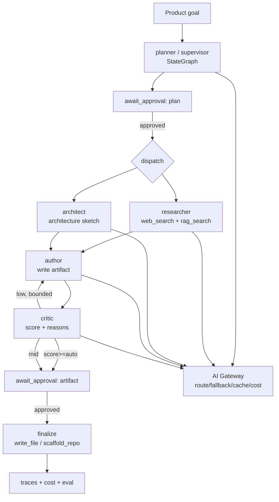

# Flagship — "Forge": a multi-agent orchestration platform (the factory)

> Build first. Interview centerpiece **and** the factory that scaffolds every other product below.
> Working name: **Forge**. One-line: *give it a product goal; a supervisor coordinates worker agents
> through think → plan → build → triage, and ships a real artifact with visible reasoning, HITL
> approval, traces, and cost.*

---

## Problem
Teams want agents to do multi-step knowledge work (research, design, draft, review), but every team
re-implements the same plumbing: planning, worker coordination, shared state, tool use, human
checkpoints, evaluation, cost/latency control, and a way to *see what the agents did and why*. There
is no opinionated, governed, observable orchestration kernel that a platform team can drop in. Generic
frameworks (raw LangGraph, CrewAI, AutoGen) give you primitives, not a **governed, evaluated,
production-shaped platform**.

## Why agentic (not a chatbot)
Multi-step, stateful, tool-using, with branching decisions: a supervisor decomposes a goal, dispatches
specialized workers, collects results into a shared blackboard, a critic gates quality, and a human
approves at defined checkpoints. A chatbot cannot plan-dispatch-critique-revise with durable state and
an audit trail.

## Target user / buyer
Platform / AI-platform teams in any dev org; later, internal "agent platform" owners. Buyer = eng
leadership who must ship agentic features *safely* (governance, eval, cost) — not researchers.

## What's genuinely new vs. my secops stack
~80% of the substrate already exists in `ai-secops-copilot`. The net-new is the **generalization** of
the kernel from "finding → ticket" to "goal → plan → workers → artifact":
- **Supervisor/planner** that decomposes a goal into an ordered task plan.
- **Worker roster** (Researcher, Architect, Author, Critic) as graph nodes.
- **Critic-score-gated** loop (generalization of confidence-gated governance).
- A **tool registry** (web_search, rag_search, write_file, scaffold_repo).

## Architecture (reuse-mapped to my existing code)

| Forge component | Reuses from `ai-secops-copilot` | New work |
| --- | --- | --- |
| `orchestrator/` Supervisor `StateGraph` (plan → dispatch → collect → critique → finalize) | `graph/build.py`, `graph/runner.py` (compiled graph + checkpointer) | new node wiring |
| `RunState` blackboard (goal, plan, tasks[], artifacts[], critiques[], approvals, cost) | `graph/state.py` `GraphState` pattern | new fields |
| Agent nodes: `planner`, `researcher`, `architect`, `author`, `critic`, `await_approval` | `graph/nodes.py` node + `_from_state_or_config` DI seam | new node logic |
| `AgentGateway` (route by **agent role**, fallback, cache, cost) | `gateway/` **verbatim** (router/cost/cache/providers) | route table by role |
| Structured-output guardrail + bounded reprompt per agent | `llm.analyze_and_validate`, `schemas.py`, `prompts.py` injection isolation | new Pydantic contracts |
| Critic-score-gated governance (auto-finalize / HITL / revise-loop) | `governance.py` thresholds + `reasonCode` | reframe thresholds |
| Durable HITL at plan-approval + artifact-approval | `graph/runner.py` `interrupt`/`Command(resume=...)` + `MemorySaver` | 2 interrupt points |
| Tools behind a `Tool` protocol | `rag/retriever.py`, ports & adapters style in `providers/` | web_search, write_file, scaffold |
| Eval: artifact quality (LLM-as-judge) + plan-adherence + regression gate | `evals/run_eval.py`, `evals/judge.py` | new judges |
| Observability: per-agent traces, cost/run, token tracking | `observability/`, `gateway/metrics` | agent-timeline view |
| Dashboard: run timeline, per-agent reasoning, approvals | dashboard SPA pattern | agent-trace UI |

## v1 scope — DEMOABLE in ~1 week
**In:** fixed roster (4 roles), sequential plan→workers→critic→finalize with **one** parallel fan-out
(research), 2 HITL checkpoints, AI Gateway, Pydantic-validated agent outputs, critic-gated revise loop
(bounded), 4 tools, eval (judge + plan-adherence) + CI gate, dashboard timeline, offline deterministic
mode. **Killer flow:** "produce a 1-page vision doc for `<idea>`" → emits a real `.md` to disk.

**Cut / fake:** no dynamic agent spawning or agent marketplace; no real code *execution*/sandbox
("development" = scaffold files + write code, don't run it); no multi-tenancy (pattern already proven);
web_search has a deterministic offline stub; single-user.

## 7-day milestone plan
- **D1** Extract domain-agnostic kernel (gateway/observability/guardrail/eval) into `core`; define
  `RunState` + Supervisor skeleton with deterministic stub agents → walking skeleton end-to-end offline.
- **D2** Real agent nodes + structured outputs via AI Gateway; role-aware routing; bounded reprompt.
- **D3** HITL: plan + artifact interrupts/resume; critic-score-gated revise loop.
- **D4** Tools: `rag_search` (reuse retriever), `web_search` (real+stub), `write_file`/`scaffold_repo`;
  researcher parallel fan-out → brief with citations.
- **D5** Eval harness (artifact judge + plan adherence) + CI regression gate; per-agent traces + cost.
- **D6** Dashboard (run timeline, per-agent reasoning, cost/latency, approvals); polish vision-doc flow + seed.
- **D7** Harden, docs, rehearse demo, record video.

## Demo script + "wow" moments
1. Paste goal: *"Investigate and produce a 1-page vision doc for an agentic compliance-evidence agent."*
2. Supervisor shows the **plan** → HITL **approve plan** (human steering).
3. Researcher **fans out** (RAG + web) → brief **with citations** (grounded + parallel).
4. Architect drafts a sketch in *my own stack vocabulary*.
5. Author writes the doc; Critic scores **0.62 → below bar → loops once → 0.91** (self-correction +
   eval gate — the regression-gate story, generalized).
6. HITL **approve final** → a real `.md` written to disk (tangible artifact).
7. Dashboard: agent timeline, traces, **cost $0.0x**, tokens, **model routing** (planner=strong,
   author=cheaper) — production rigor / LLMOps.
8. Meta close: *"the doc it just produced is one item in my backlog — this platform is the factory I
   used to scaffold my other products."*

## The factory loop (build multiplier)
Each backlog idea → run Forge → get (a) a vision doc and (b) a scaffolded repo (folders, README,
FastAPI skeleton, eval stub) → hand-finish. The orchestrator compounds my output across all products.

## Success metric
One goal in → approved, eval-passing artifact out, < $0.10 and < 60s, with a full trace + audit of
every agent decision. Eval regression gate green in CI.

## 5-year evolution
v1 doc/POC factory → internal agent-platform (reusable kernel for any team's agents) → governed
multi-agent runtime with agent identity/authz, long-horizon memory, and an oversight/verifier layer
(see thesis). This is the durable bet: the **oversight + orchestration + eval** plane for agents.

## Key risk
Scope creep into "another agent framework." Mitigation: fixed roster, one demo flow, ruthless v1 cut
list; differentiate on **governed + evaluated + observable**, not on primitives.
