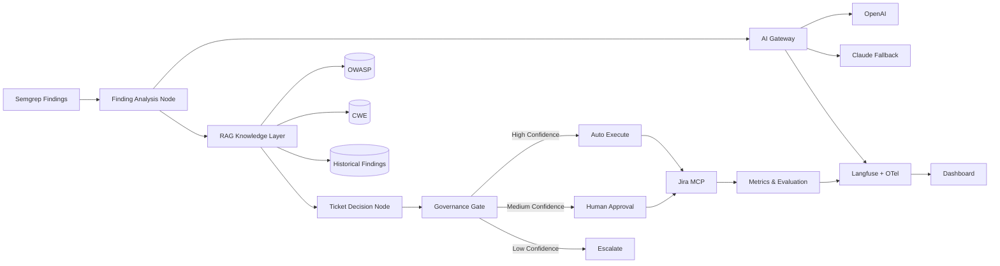

# AI Security Operations Copilot — Product Vision (LOCKED)

> Canonical product vision. Source of truth for: **Resume · LinkedIn · GitHub README ·
> recruiter conversations · system-design interviews · demo-video narration.**
> Repo slug: `ai-secops-copilot`. Status: **VISION LOCKED — build from MVP Scope only.**

---

## Elevator Pitch

**One sentence:** An enterprise AI platform that automates the security-finding lifecycle —
analysis, prioritization, governed ticketing, and remediation tracking — using agentic workflows,
RAG, evaluation pipelines, and human-in-the-loop governance.

**Full:** AI Security Operations Copilot ingests findings from scanners (Semgrep/Bandit/SAST/SCA),
reasons about them with retrieval-augmented security knowledge (OWASP/CWE/CVE), and drives the ticket
lifecycle in Jira/ServiceNow through governed, confidence-gated automation — with full observability,
cost tracking, and evaluation so you can prove it actually works.

---

## The Problem

Security teams receive thousands of findings from Semgrep, Bandit, SAST, SCA, container, and cloud
scanners. Each finding requires manual effort: understand the issue, determine severity, spot false
positives, create and assign Jira tickets, track remediation, and close them. This is expensive, slow,
inconsistent, and does not scale.

## The Solution

An intelligent security analyst that:
- **Understands findings** (SQL injection, secrets exposure, hardcoded credentials, command injection, weak crypto).
- **Reasons with security knowledge** via RAG (OWASP Top 10, CWE, CVE, runbooks, historical findings).
- **Makes decisions** (severity, risk, priority, recommended action) with a confidence score.
- **Executes actions** through MCP tools (create/update/comment/transition/close tickets).
- **Applies governance** (confidence-gated: auto-execute / human approval / escalate).

## What This Is NOT (scope guardrails + interview clarity)

- **Not a scanner** — Semgrep/Bandit produce findings; this triages and acts on them.
- **Not a SIEM / not Snyk / not Checkmarx** — it sits *downstream* of detection.
- **Not a human replacement** — it augments analysts with governed automation and keeps humans in the loop on anything uncertain.

---

## Governance Model (two thresholds → three dispositions)

Mirrors the confidence-gating already built in `obs-agent`'s `AuthorityEvaluationService`
(autonomousThreshold / suggestThreshold → APPROVED / SUGGESTED / SUPPRESSED). Reuse that pattern.

```text
confidence >= autoThreshold (e.g. 0.90)   → AUTO-EXECUTE
suggestThreshold <= confidence < auto      → HUMAN APPROVAL REQUIRED
confidence < suggestThreshold (e.g. 0.60)  → ESCALATE / REVIEW
```

Demo moment (memorable): Finding A @ 0.95 → auto-creates Jira ticket; Finding B @ 0.71 → waits for approval.

---

## MVP Scope (brutally small — this is the ONLY build surface)

**Input — Semgrep finding**
```json
{ "id": "F-101", "title": "SQL Injection", "description": "User input flows into SQL query.", "file": "users.js" }
```

**AI analysis output (validated via Pydantic/Zod before any action)**
```json
{ "severity": "critical", "confidence": 0.95, "reason": "Potential SQL injection vulnerability", "recommendedAction": "create_ticket" }
```

**Governance:** confidence-gated (auto / approval / escalate as above).
**Ticketing:** Jira **real**, ServiceNow **mock** (same "provider-agnostic MCP layer" story, half the effort).
**Dashboard (single page):** findings processed, tickets created, approval rate, automation rate,
evaluation score, average latency, token cost, cache hit rate.
*(Built Day 8: served at `/dashboard` with KPI cards, autonomy-split, live audit trail, and
one-click `POST /demo/seed`. Token cost + cache-hit rate land with the AI Gateway, Day 11.)*

---

## Architecture (locked — this flow IS the acceptance test)

The AI Gateway sits **before** LLM execution (it is the single egress for all model calls), so
"where does model routing happen?" has an obvious answer.



### System Flow (the single user flow that matters)
```text
Security Finding → Finding Analysis → Confidence Score → Governance Decision
→ (Auto Execute | Human Approval) → Jira Ticket → Metrics + Evaluation
```

> Node naming is explicit on purpose: **Finding Analysis Node** and **Ticket Decision Node**
> (not generic "Analysis/Decision").

---

## Staff-Level Features (what most candidates miss)

1. **Idempotency** — `finding_hash`/`finding_id` key prevents duplicate tickets on retry.
2. **Structured-output validation** — every LLM response validated (Pydantic/Zod) before execution.
3. **Provider fallback** — OpenAI fails → Claude (no sophisticated router).
4. **Prompt-injection protection** — finding data is untrusted input ≠ system instructions
   (context isolation, structured inputs, tool approval).
5. **Confidence-gated governance** — the three-disposition model above.

## Failure Handling (pure Staff-level thinking)

| Failure | Response |
| --- | --- |
| LLM timeout | Retry with backoff |
| Provider failure | Claude fallback (via Gateway) |
| Invalid structured output | Re-prompt (bounded retries), then escalate |
| Tool (MCP) failure | Retry → route to approval queue |
| Jira API failure | Dead-letter queue + alert |
| Duplicate finding | Idempotency key (`finding_hash`) — no duplicate ticket |

## Platform KPIs (dashboard + interview story)

Measurable outcomes, reported from real eval/runtime data (not fabricated):
- Severity classification accuracy
- Ticket action accuracy
- Automation rate (auto-executed / total)
- Approval rate (sent to human / total)
- Mean processing time (latency)
- Cache hit rate
- Cost per finding (tokens × price)
- False-positive reduction rate

## Evaluation Strategy (the differentiator)

- **Golden dataset:** ~50 labeled findings (severity + expected action), hand-labeled, provenance documented.
- **Metrics:** severity accuracy / confusion matrix; FP detection precision-recall-F1; ticket-action accuracy;
  LLM-as-judge for free-text root-cause quality.
- **Regression gate:** eval runs after every change; capture one before/after delta
  ("prompt change caught a 6% severity regression") — the single best interview moment.

---

## Scale & Non-Functionals (system-design talking points — NOT MVP)

How it scales to 10k findings/day (this is the 17-year-experience differentiator in design rounds):
- Queue-based ingestion (BullMQ/SQS) in front of the graph; stateless workers; horizontal scale.
- Idempotency keys + dedupe; retry with backoff + dead-letter queue; backpressure control.
- Multi-tenancy (per-tenant config, isolation); rate-limiting per provider.
- Cost controls: semantic cache, token budgets, model routing by task complexity.
- Observability/SLOs: traces per finding, eval-score and automation-rate as platform KPIs.

---

## Tech Stack (hybrid)

- **Control plane / API:** NestJS + TypeScript (leverage existing expertise).
- **Agent runtime:** Python + LangGraph (the Copilot's orchestration IS the veho-platform upgrade — one codebase).
- **Vector store:** Postgres + pgvector. **Cache:** Redis (semantic cache).
- **LLMs:** OpenAI + Claude (fallback). **Observability:** OpenTelemetry + Langfuse.
- **Evals:** DeepEval / RAGAS. **MCP:** Jira (real), ServiceNow (mock).

---

## Interview Story (why I built this)

> During my work on large-scale security workflow orchestration and ticketing platforms, I saw that
> security teams spend significant effort triaging findings, creating tickets, and tracking remediation.
> I built AI Security Operations Copilot to explore how agentic workflows, RAG, governance controls, and
> evaluation pipelines can automate those processes while maintaining reliability, observability, and
> human oversight.

Connects directly to real background — far stronger than "I wanted to learn LangGraph."

## What Success Looks Like (Day-15 demo)

`Semgrep finding → AI analysis → severity + confidence → governance decision → Jira ticket → metrics dashboard`

And being able to explain: **why** RAG, **how** evals work, **why** governance exists, **how** idempotency
prevents duplicates, **how** prompt injection is mitigated, **how** costs are tracked, **how** model fallback works.

---

## Ready-to-Paste One-Liners

**Resume:**
> Built AI Security Operations Copilot — an enterprise AI platform automating the security-finding
> lifecycle (analysis → governed ticketing → remediation tracking) using LangGraph agentic workflows,
> RAG (OWASP/CWE/pgvector), MCP tool integrations (Jira/ServiceNow), confidence-gated HITL governance,
> an LLM gateway (multi-model routing, semantic cache, cost tracking), evaluation pipelines, and
> OpenTelemetry/Langfuse observability.

**LinkedIn headline add:** AI Platform Engineer | Agentic Workflows · RAG · Evals · LLMOps · Governance.

**GitHub tagline:** Governed, observable AI copilot that triages security findings and drives the
ticket lifecycle — LangGraph + RAG + MCP + evals + HITL.
