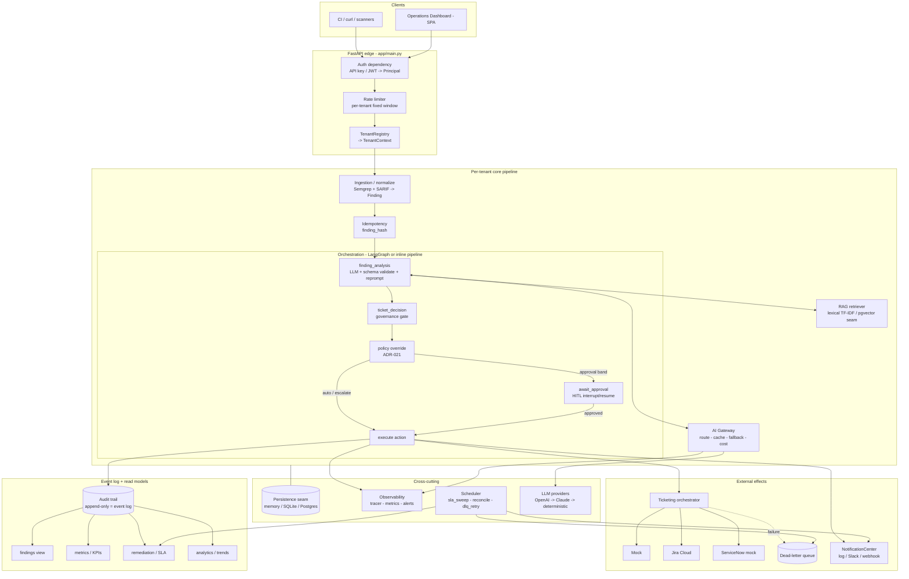

# System Design & Architecture — AI Security Operations Copilot

> One reference that ties together the **complete architecture flow**, the **event-driven (EDA)
> flow**, the **AI architecture**, the **execution & configuration plan**, the **design patterns**
> used, and the **full API surface**. This describes the *as-built* runtime (Days 1–20), which runs
> fully offline with no keys; managed providers, Postgres/Redis, and OTel light up by configuration
> only. For the per-decision rationale see [`architecture-decisions.md`](architecture-decisions.md);
> for the target vs as-built diagrams see [`diagrams/architecture.md`](diagrams/architecture.md).

---

## 1. What the system does (one paragraph)

A scanner report (Semgrep JSON / SARIF) comes in. Each finding is **normalized** to a canonical
contract, **hashed** for idempotency, **grounded** with OWASP/CWE knowledge (RAG), **analyzed** by an
LLM into a *validated* structured verdict, and run through a **confidence-gated governance** decision
(auto-execute / human-approval / escalate). Optional **policy-as-code** rules can deterministically
override that decision. The action stage creates/relays a ticket (Mock / Jira / ServiceNow) with
**idempotency** and a **dead-letter queue** on failure. Every decision is written to an **append-only
audit trail**, which is the event log that all read models (findings, KPIs, remediation/SLA, trend
analytics) are projected from. **Notifications/webhooks**, a **background scheduler**, **multi-tenancy
+ auth**, and an in-process **observability** stack (tracing, Prometheus metrics, alerting) wrap it.

---

## 2. Complete architecture flow (components)



**Layering (clean/hexagonal):**

| Layer | Modules | Responsibility |
| --- | --- | --- |
| **Edge / transport** | `main.py`, `auth.py`, `ratelimit.py`, `tenancy.py` | HTTP, authn/z, rate limit, tenant resolution, DI |
| **Orchestration** | `graph/` (build, runner, nodes, state), `pipeline.py` | The agent flow; LangGraph compiled graph + dependency-free fallback |
| **Domain / reasoning** | `domain.py`, `schemas.py`, `governance.py`, `policy.py`, `idempotency.py`, `analysis.py`, `prompts.py` | Pure decision logic + contracts (no I/O) |
| **Capabilities (ports)** | `llm.py`, `rag/`, `ticketing.py`, `providers/`, `gateway/`, `notifications.py` | Pluggable seams behind protocols |
| **Read models** | `metrics.py`, `remediation.py`, `analytics.py` | Projections over the audit event log |
| **Cross-cutting** | `observability/`, `scheduler.py`, `persistence/`, `config.py` | Tracing/metrics/alerts, jobs, storage, config |

---

## 3. End-to-end request flow (sequence)

```mermaid
sequenceDiagram
    autonumber
    participant C as Client / Scanner
    participant API as FastAPI edge
    participant T as Tenant context
    participant G as LangGraph / pipeline
    participant R as RAG
    participant GW as AI Gateway
    participant GOV as Governance + Policy
    participant TK as Ticketing
    participant EV as Audit log + Notify

    C->>API: POST /ingest (SARIF/Semgrep) [X-API-Key / Bearer]
    API->>API: authenticate -> Principal, rate-limit
    API->>T: resolve isolated TenantContext
    API->>G: normalize -> Finding(s), compute finding_hash
    G->>R: retrieve_for_finding(k) -> OWASP/CWE context (+citations)
    G->>GW: complete(prompt = system + UNTRUSTED finding + TRUSTED context)
    GW->>GW: cache lookup -> route -> provider (fallback chain)
    GW-->>G: AnalysisResult (validated; reprompt up to N on schema fail)
    G->>GOV: confidence + recommendedAction -> disposition
    GOV->>GOV: policy rules (first-match) may override -> reasonCode=policy:<id>
    alt auto_execute
        GOV->>TK: create/suppress (idempotent by finding_hash)
        TK-->>EV: outcome (ticket_created / suppressed)
    else human_approval
        GOV->>EV: enqueue approval (graph: interrupt + checkpoint)
        Note over G,EV: resume later via /approvals/.../approve or /graph/resume
    else escalate
        GOV->>EV: enqueue escalation
    end
    TK-->>EV: on failure -> dead-letter (replayable)
    EV->>EV: append AuditRecord (event) + emit notification
    EV-->>C: {decision, action, retries, errors}
```

---

## 4. Event-Driven Architecture (EDA) flow

The system is **event-centric**: the audit trail is an **append-only event log**, all dashboards are
**projections (read models)** over it, and side-effects fan out through a **publish/subscribe**
notification bus. External systems push **inbound webhook events**; a **scheduler** produces
**time-triggered events**.

```mermaid
flowchart LR
    subgraph producers [Event producers]
        P1[Pipeline decision\nsystem]
        P2[Human approve/reject\nactor=human]
        P3[Inbound webhook\nprovider lifecycle]
        P4[Scheduler tick\nsla_sweep / reconcile / dlq_retry]
        P5[Manual transition\nPOST /tickets/{h}/transition]
    end

    LOG[(Append-only Audit Trail\nthe event log / source of truth)]

    subgraph projections [Read models - derived on read]
        V1[findings\ncurrent-state, deduped]
        V2[metrics\nautomation - approval - escalation]
        V3[remediation\nSLA status, MTTR]
        V4[analytics\ntrends, deltas, report]
    end

    subgraph bus [NotificationCenter - pub/sub]
        E1{{escalation}}
        E2{{approval_required}}
        E3{{sla_breach}}
        E4{{ticket_resolved}}
        CH1[LogChannel]
        CH2[SlackChannel]
        CH3[WebhookChannel - HMAC signed]
    end

    P1 & P2 & P3 & P4 & P5 --> LOG
    LOG --> V1 & V2 & V3 & V4
    P1 --> E1 & E2
    P4 --> E3
    P3 & P5 --> E4
    E1 & E2 & E3 & E4 --> CH1 & CH2 & CH3
```

**Event taxonomy & guarantees**

| Event | Producer | Effect | Guarantee |
| --- | --- | --- | --- |
| Decision (`auto_execute` / `human_approval` / `escalate`) | pipeline (`actor=system`) | append `AuditRecord`; maybe ticket; maybe notify | **idempotent** by `finding_hash` (re-ingest grows events, not findings/tickets) |
| `ticket_resolved` | webhook / transition / reconcile job | append audit event; emit notification | de-duplicated (no repeat resolution event) |
| `sla_breach` | `notifications/sweep` + scheduler | emit notification | **per-finding dedupe** in `NotificationCenter` |
| `approval_required`, `escalation` | governance | emit notification | dedupe on `(event, finding_hash)` |
| Inbound provider webhook | external (Jira/ServiceNow/generic) | `transition()` ticket -> resolution event | **HMAC-SHA256** verified when secret set |
| Scheduler tick | `Scheduler` loop | fan-out job across tenants | per-job **lock** + error isolation |

**Why this matters (design intent):** writing events once and deriving every view on read gives a
single source of truth, trivial auditability ("why did this happen?"), restart-safety (views survive
restarts wherever the log is durable), and clean separation between the **write path** (decide + append)
and the **read path** (project) — a lightweight **event-sourcing + CQRS** shape.

---

## 5. AI architecture flow

```mermaid
flowchart TB
    subgraph orch [LangGraph compiled StateGraph - graph/build.py]
        ING[ingest\nfinding_hash, init state]
        FA[finding_analysis\nLLM call + Pydantic validate + bounded reprompt]
        TD[ticket_decision\ngovernance + policy override]
        ROUTE{route on disposition}
        EX[execute\ncreate / suppress / escalate]
        AW[await_approval\ninterrupt -> checkpoint -> resume]
    end

    subgraph rag [RAG knowledge layer - rag/]
        CORP[(OWASP / CWE corpus)]
        RET[KnowledgeRetriever seam\nLexical TF-IDF default | pgvector]
        CITE[citations attached to decision]
    end

    subgraph gwy [AI Gateway - gateway/ - single LLM egress]
        CACHE[Semantic cache\nlexical Jaccard offline / Redis prod]
        ROUTER[Task-aware router]
        FB[Ordered fallback chain]
        COST[Cost + latency + token tracker]
    end

    subgraph prov [Providers - llm.py / gateway/providers.py]
        OAI[OpenAI]
        CLA[Claude]
        DET[Deterministic stand-in\nrule-based, offline, $0]
    end

    ING --> FA
    FA -->|retrieve_for_finding| RET --> CORP
    RET --> CITE --> TD
    FA -->|complete| CACHE --> ROUTER --> FB
    FB --> OAI --> CLA --> DET
    FB --> COST
    FA --> TD --> ROUTE
    ROUTE -->|auto / escalate| EX
    ROUTE -->|approval band| AW --> EX
```

**AI guardrails & seams (the "governed automation" story):**

- **Structured-output contract (ADR-010):** the LLM must return JSON validated by a Pydantic schema
  (`schemas.AnalysisResult`: `severity`, `confidence`, `reason`, `recommendedAction`). Invalid output
  triggers a **bounded reprompt** (`ANALYSIS_MAX_RETRIES`); persistent failure **escalates** rather
  than acting on garbage.
- **Prompt-injection isolation (ADR-011):** finding text is **UNTRUSTED** and is kept separate from
  system instructions and from the **TRUSTED** RAG context in `prompts.py`.
- **Confidence-gated governance (ADR-005):** two thresholds → three dispositions with an **asymmetric**
  bar — auto-*suppress* must clear a higher confidence (`0.95`) than auto-*ticket* (`0.90`), because
  silently dismissing a real vuln is the costlier error. Every disposition carries a machine `reasonCode`.
- **Policy-as-code (ADR-021):** deterministic, per-tenant rules evaluated *after* governance can
  `suppress` / `force_escalate` / `force_ticket` / `annotate`, audited as `reasonCode=policy:<id>`.
- **AI Gateway (ADR-014):** the runtime **never calls a provider directly**; one egress does routing,
  **cache-aside** semantic caching, an **ordered fallback** chain ending in the always-on deterministic
  provider (so it never hard-fails), and cost/latency/token accounting.
- **RAG grounding (ADR-001/002):** retrieval is a seam — lexical TF-IDF offline by default, pgvector in
  prod — and attaches **citations** to each decision.
- **Durable HITL (ADR-004):** the compiled graph **interrupts** at the approval gate and **checkpoints**,
  so a run can pause in one request and resume (approve/reject) in another by `thread_id`.
- **Evaluation harness (ADR-012):** `evals/run_eval.py` scores severity/action accuracy, FP precision/
  recall/F1, RAG retrieval quality, LLM-as-judge reasoning, and governance tuning — a **regression gate**.

---

## 6. Execution & configuration plan

### 6.1 Run modes

| Mode | Command | Backing services | Use |
| --- | --- | --- | --- |
| **Offline demo** | `python scripts/demo_walkthrough.py` | none (in-process TestClient, deterministic LLM) | narrated end-to-end smoke test |
| **Local API** | `python -m uvicorn app.main:app --reload --port 8088` | in-memory by default | dashboard at `http://localhost:8088/` |
| **Local durable** | set `DATABASE_URL=sqlite:///secops.db` then run uvicorn | SQLite | persistence across restarts |
| **Full stack** | `docker compose up` | Postgres/pgvector + Redis + agent-runtime + NestJS gateway | production-shaped |
| **CI** | `make test` / GitHub Actions | SQLite | lint + pytest (Python 3.11/3.12 matrix) + eval gate + Docker build/publish |
| **Tests / evals** | `pytest -q` · `python evals/run_eval.py` | in-memory | 198 tests + regression gate |

### 6.2 Configuration (env-driven, safe offline defaults) — `app/config.py`

```mermaid
flowchart LR
    subgraph offline [Offline defaults - zero config]
        D1[LLM: deterministic - no keys]
        D2[State: in-memory]
        D3[RAG: lexical TF-IDF]
        D4[Tickets: mock]
        D5[Auth: off -> default tenant]
        D6[Scheduler: off - on-demand only]
        D7[Policy: none -> no override]
    end
    subgraph prod [Production - by configuration only]
        P1[OPENAI/ANTHROPIC_API_KEY -> real providers]
        P2[DATABASE_URL -> SQLite/Postgres + pgvector]
        P3[TICKET_PROVIDER=jira + JIRA_*]
        P4[AUTH_ENABLED + API_KEYS / JWT_SECRET + RATE_LIMIT_RPM]
        P5[SCHEDULER_ENABLED + intervals]
        P6[SLACK/NOTIFY_WEBHOOK_URL + WEBHOOK_SECRET]
        P7[OTEL_ENABLED -> OTLP export]
        P8[POLICY_RULES / POLICY_RULES_PATH]
    end
    offline -->|flip flags| prod
```



**Key environment variables (grouped):**

| Group | Vars | Default → effect |
| --- | --- | --- |
| Service | `SERVICE_NAME`, `ENVIRONMENT`, `HOST`, `PORT` | `agent-runtime`, dev, `0.0.0.0:8088` |
| LLM / Gateway | `OPENAI_API_KEY`/`OPENAI_MODEL`, `ANTHROPIC_API_KEY`/`ANTHROPIC_MODEL`, `LLM_TIMEOUT_S`, `LLM_CACHE_ENABLED`, `LLM_CACHE_SIMILARITY` | no keys → deterministic; cache on (0.92) |
| Governance | `GOVERNANCE_AUTO_THRESHOLD` (0.90), `GOVERNANCE_SUGGEST_THRESHOLD` (0.60), `GOVERNANCE_SUPPRESS_AUTO_THRESHOLD` (0.95), `ANALYSIS_MAX_RETRIES` (2) | tuned from eval data |
| RAG | `RAG_ENABLED` (true), `RAG_TOP_K` (3) | lexical; pgvector when `DATABASE_URL` set |
| Ticketing | `TICKET_PROVIDER` (mock\|jira\|servicenow), `JIRA_BASE_URL/EMAIL/API_TOKEN/PROJECT_KEY/ISSUE_TYPE` | mock offline |
| Persistence | `DATABASE_URL` (memory→sqlite→postgres), `REDIS_URL` | in-memory |
| Tenancy / auth | `AUTH_ENABLED` (false), `API_KEYS` (`key:tenant,...`), `JWT_SECRET`, `JWT_ALGORITHM` (HS256), `DEFAULT_TENANT`, `RATE_LIMIT_RPM` (0=off) | open, single tenant |
| Notifications | `NOTIFICATIONS_ENABLED` (true), `SLACK_WEBHOOK_URL`, `NOTIFY_WEBHOOK_URL`, `WEBHOOK_SECRET`, `WEBHOOK_TIMEOUT_S` | log channel only |
| Scheduler | `SCHEDULER_ENABLED` (false), `SLA_SWEEP_INTERVAL_S` (60), `RECONCILE_INTERVAL_S` (120), `DEADLETTER_RETRY_INTERVAL_S` (120) | on-demand only |
| Observability | `OTEL_ENABLED` (false), `OTEL_EXPORTER_OTLP_ENDPOINT`, `LOG_JSON` (true), `ALERT_*` thresholds | in-process tracer + Prometheus |
| Policy | `POLICY_RULES` (inline JSON), `POLICY_RULES_PATH` | none |

### 6.3 Startup lifecycle

`FastAPI(lifespan=...)` → register jobs → start scheduler if enabled → serve → graceful stop on
shutdown. Shared singletons (RAG corpus, tracer, time-series, `TenantRegistry`, `Scheduler`,
rate-limiter) are built once at import; per-tenant `TenantContext` is built lazily on first request.

---

## 7. Design patterns used

| Pattern | Where | Why |
| --- | --- | --- |
| **Ports & Adapters (Hexagonal)** | `LLMClient`, `KnowledgeRetriever`, `TicketProvider`, persistence `Store`, notification `Channel`, `Judge` protocols | swap implementations without touching the core; offline by default |
| **Strategy** | provider selection, retriever backend, persistence backend, notification channel | runtime-selectable behavior behind one interface |
| **Factory** | `providers/factory.py`, `build_gateway`, `build_engine` (policy), `build_notification_center`, `get_retriever`, `build_state` | construct the right adapter from config/tenant |
| **Dependency Injection** | FastAPI `Depends`/`Annotated` (`CtxDep`, `_SettingsDep`); node deps via graph `config`/state seam | testable, override-able (`app.dependency_overrides`) |
| **Chain of Responsibility / ordered fallback** | AI Gateway provider chain `OpenAI → Claude → deterministic` | resilience; never hard-fail on outage |
| **Cache-aside** | gateway semantic cache | cut cost/latency on near-duplicate prompts |
| **Event Sourcing** | append-only audit trail (`AuditRecord`) | source of truth, full "why" history |
| **CQRS (read models / projections)** | `project_findings`, `compute_metrics`, `build_remediation`, analytics | separate write (append) from read (derive) |
| **Materialized view** | current-state findings deduped by `finding_hash` | re-ingest never duplicates rows |
| **Saga / durable HITL (interrupt–resume)** | LangGraph `interrupt()` + `MemorySaver` checkpoint + `Command(resume=...)` | pause for a human across requests |
| **Idempotency key** | `idempotency.finding_hash` | exactly-one ticket per finding |
| **Dead Letter Queue** | `ticketing.DeadLetterQueue` + retry job | survive provider failures, replay later |
| **Publish/Subscribe (event bus)** | `NotificationCenter` → channels | fan out events to multiple sinks |
| **Webhook + HMAC message authentication** | `sign`/`verify_signature`, `/webhooks/tickets` | secure real-time inbound lifecycle sync |
| **Rules engine / Policy-as-code** | `policy.PolicyEngine` (first-match-wins) | declarative overrides, audited |
| **Guardrail / structured-output validation + bounded retry** | `finding_analysis_node` + Pydantic | never act on unvalidated LLM output |
| **Bulkhead / multi-tenant isolation** | `TenantRegistry` → isolated `TenantContext` | one tenant can't see/affect another |
| **Rate limiting (fixed window)** | `ratelimit.RateLimiter` | per-tenant fairness / abuse control |
| **Scheduler / periodic worker** | `scheduler.Scheduler` (asyncio, per-job lock) | SLA sweep, reconcile, DLQ retry |
| **Pull-based metrics + rule-based alerting** | `observability/prometheus.py`, `alerts.py` | standard scrape + transparent alerts |
| **Context propagation (tracing)** | `observability/tracing.py` (`contextvars` spans) | linked spans, optional OTLP export |
| **Adapter / Anti-Corruption Layer** | `ingestion/` SARIF+Semgrep → `Finding` contract | isolate external formats from the core |
| **Singleton (shared, safe-to-share)** | tracer, registry, retriever, scheduler | one instance per process |
| **Walking skeleton / dual orchestration** | `pipeline.run_pipeline` mirrors the compiled graph | works with or without LangGraph installed |

---

## 8. Complete API reference

All business endpoints resolve a **tenant context** via `get_ctx` (auth → rate-limit → registry).
With `AUTH_ENABLED=false` (default) every request maps to `DEFAULT_TENANT`; you may still pick a
tenant with the `X-Tenant-Id` header for offline isolation demos. With auth on, send `X-API-Key:
<key>` or `Authorization: Bearer <api-key-or-JWT>`. `/health`, `/jobs*`, `/webhooks/tickets`, and the
dashboard are **not** tenant-scoped.

### 8.1 Core pipeline

| Method | Path | Body / Query | Purpose |
| --- | --- | --- | --- |
| POST | `/analyze` | `{finding}` | Run one finding end-to-end (inline pipeline) and execute the decision |
| POST | `/ingest` | `{report, format?}` | Normalize a Semgrep/SARIF report and run **every** finding |
| POST | `/governance/preview` | `{confidence, recommendedAction}` | Pure gate preview (no LLM) — confidence → disposition |
| GET | `/knowledge/search` | `?q=&k=3` | RAG retrieval of OWASP/CWE guidance |

### 8.2 Orchestration (compiled LangGraph)

| Method | Path | Body | Purpose |
| --- | --- | --- | --- |
| GET | `/graph` | — | Introspect compiled graph (nodes + mermaid) |
| POST | `/graph/analyze` | `{finding}` | Run via the graph; **pauses** at the HITL gate (`awaiting_approval`) |
| POST | `/graph/resume/{thread_id}` | `{approved}` | Resume a paused run (approve/reject) |

### 8.3 Findings, approvals, tickets, audit

| Method | Path | Purpose |
| --- | --- | --- |
| GET | `/findings` | Current-state findings (deduped by `finding_hash`) + linked ticket |
| GET | `/audit` | Append-only governance audit trail (the event log) |
| GET | `/approvals` | Decisions awaiting human approval |
| POST | `/approvals/{finding_hash}/approve` | Approve → create the ticket (HITL) |
| POST | `/approvals/{finding_hash}/reject` | Reject a pending decision |
| GET | `/tickets` | Tickets created so far |
| GET | `/escalations` | Escalated findings |
| GET | `/deadletter` | Failed ticket actions (replayable) |

### 8.4 Remediation & lifecycle (Day 16)

| Method | Path | Body | Purpose |
| --- | --- | --- | --- |
| GET | `/remediation` | — | Per-ticket SLA status, age, MTTR + portfolio summary |
| POST | `/tickets/{finding_hash}/transition` | `{status}` | Apply a lifecycle status (open/in_progress/resolved/closed) |
| POST | `/remediation/sync` | — | Reconcile findings with resolved tickets |

### 8.5 Notifications & webhooks (Day 17)

| Method | Path | Body | Auth | Purpose |
| --- | --- | --- | --- | --- |
| GET | `/notifications` | `?limit=50` | tenant | Recent outbound notifications + active channels |
| POST | `/notifications/sweep` | — | tenant | Detect SLA breaches now and fire (deduped) `sla_breach` |
| POST | `/webhooks/tickets` | provider payload | **HMAC** (`X-Signature` when `WEBHOOK_SECRET` set) | Inbound real-time lifecycle sync (generic/Jira/ServiceNow) |

### 8.6 Policy-as-code (Day 19)

| Method | Path | Body | Purpose |
| --- | --- | --- | --- |
| GET | `/policy` | — | Active rules for this tenant + per-rule hit counts |
| POST | `/policy/rules` | `{rules:[...]}` | Replace this tenant's rules at runtime (resets hits) |
| POST | `/policy/evaluate` | `{finding, severity?}` | Dry-run: would a rule match? (no side effects) |

Rule shape: `{id, action: suppress|force_escalate|force_ticket|annotate, severity?, ruleIds?, paths?, tenants?, reason?, enabled?}` (first-match-wins).

### 8.7 Analytics & reporting (Day 20)

| Method | Path | Query | Purpose |
| --- | --- | --- | --- |
| GET | `/analytics/summary` | `?window_days=30&bucket=day` | Roll-up: rates, suppression/policy, resolution, MTTR/SLA, **deltas** |
| GET | `/analytics/trends` | `?window_days=30&bucket=day\|week\|hour` | Bucketed time-series |
| GET | `/analytics/report` | `?window_days=30&bucket=day` | Self-contained **Markdown** executive report |

### 8.8 Observability & ops

| Method | Path | Purpose |
| --- | --- | --- |
| GET | `/metrics` | Platform KPIs (automation/approval/escalation, latency) |
| GET | `/gateway/metrics` | AI Gateway egress: requests, cache hits, fallbacks, cost |
| GET | `/observability/metrics` | **Prometheus** text exposition (scrape target) |
| GET | `/observability/alerts` | Firing alerts over governance/cost/reliability |
| GET | `/observability/timeseries` | Cost/latency over time (charts) |
| GET | `/observability/traces` | Recent spans from the in-process tracer |
| GET | `/jobs` | Background-job status (not tenant-scoped) |
| POST | `/jobs/run/{name}` | Run `sla_sweep`/`provider_reconcile`/`deadletter_retry` once |

### 8.9 Platform / demo

| Method | Path | Purpose |
| --- | --- | --- |
| GET | `/` → `/dashboard` | Single-page operations dashboard |
| GET | `/health` | Liveness + config snapshot (container healthcheck; no auth) |
| POST | `/demo/seed` | Ingest bundled Semgrep + SARIF samples (one-click demo) |
| POST | `/demo/reset` | Clear the caller's tenant state |

### 8.10 Status codes & conventions

- `200` success · `202`-style "pending approval" surfaced in the JSON body (`status: awaiting_approval`).
- `400` invalid body/rules · `401/403` auth failure · `404` unknown finding/thread/job ·
  `429` rate limit (with `Retry-After`).
- Responses are JSON except `/observability/metrics` and `/analytics/report` (`text/plain`/Markdown)
  and the dashboard (`text/html`).
- Idempotency is implicit: repeating `/analyze`/`/ingest`/`/demo/seed` grows the **audit event count**
  but not findings or tickets (keyed by `finding_hash`).

---

## 9. Cross-cutting guarantees (summary)

- **Offline-first:** every external dependency has an in-process stand-in; no keys required to run.
- **Deterministic:** the deterministic LLM + fixed corpus make demos/tests reproducible.
- **Auditable:** every decision is an event with a machine `reasonCode` (incl. `policy:<id>`).
- **Idempotent & resilient:** `finding_hash` dedupe, DLQ + retry job, ordered LLM fallback.
- **Isolated & secured:** per-tenant bulkheads, API-key/JWT auth, per-tenant rate limiting, HMAC webhooks.
- **Observable:** linked traces, Prometheus metrics, a transparent alert rule engine, and trend analytics.
- **Configuration-driven:** the same image goes from laptop (memory/mock) to prod (Postgres/Jira/OTel)
  by flipping environment flags — no code changes.
```
