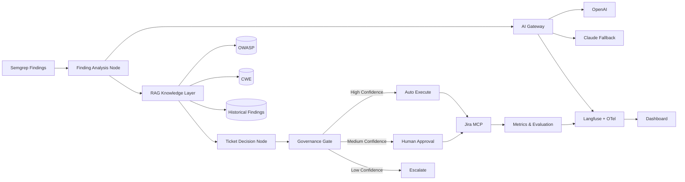
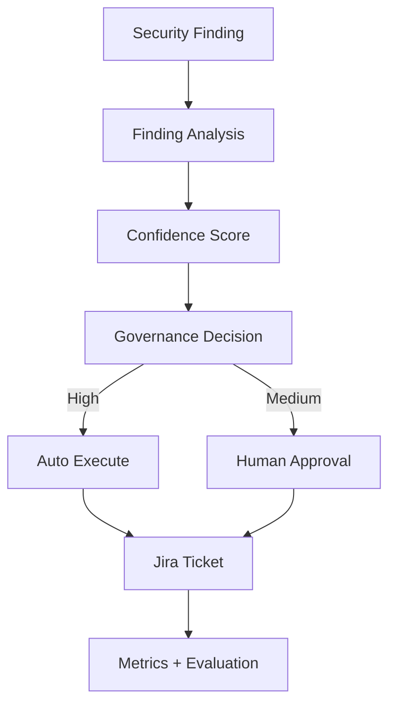
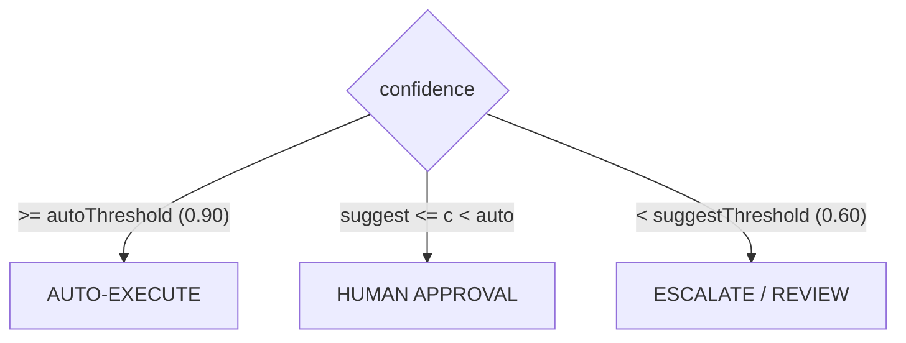
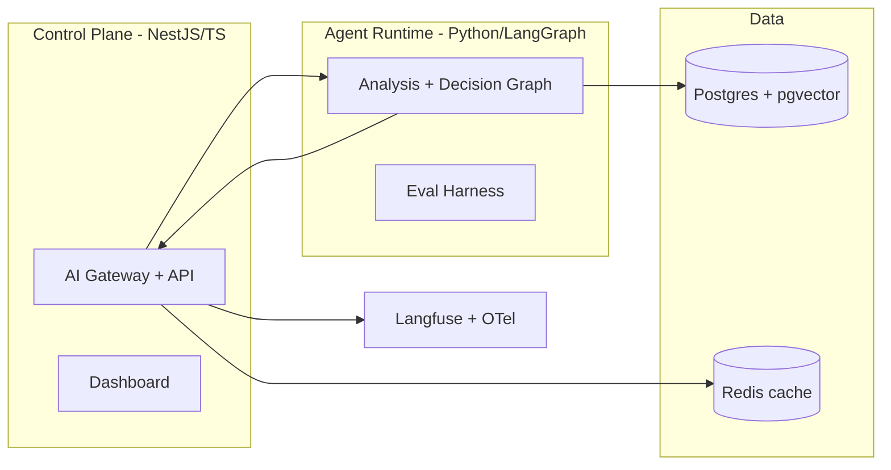

# Architecture Diagrams — AI Security Operations Copilot

## System Architecture (AI Gateway as single LLM egress)

## System Flow (the single user flow that matters)

## Governance Model (two thresholds → three dispositions)

## Hybrid Deployment Topology

