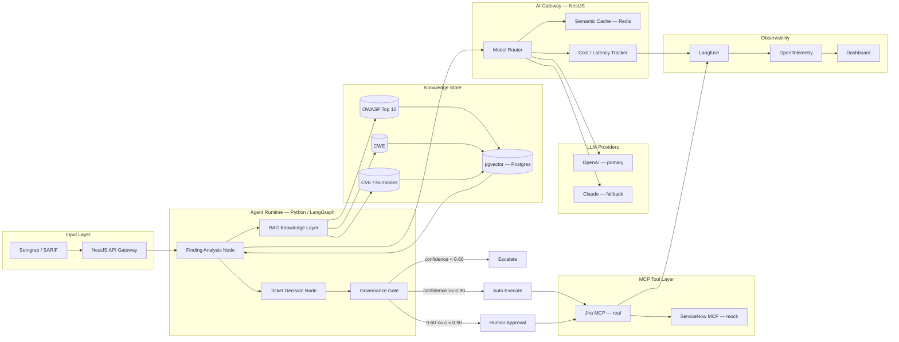
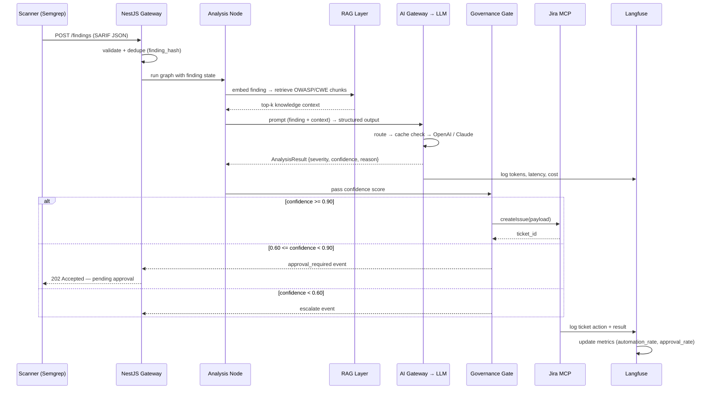
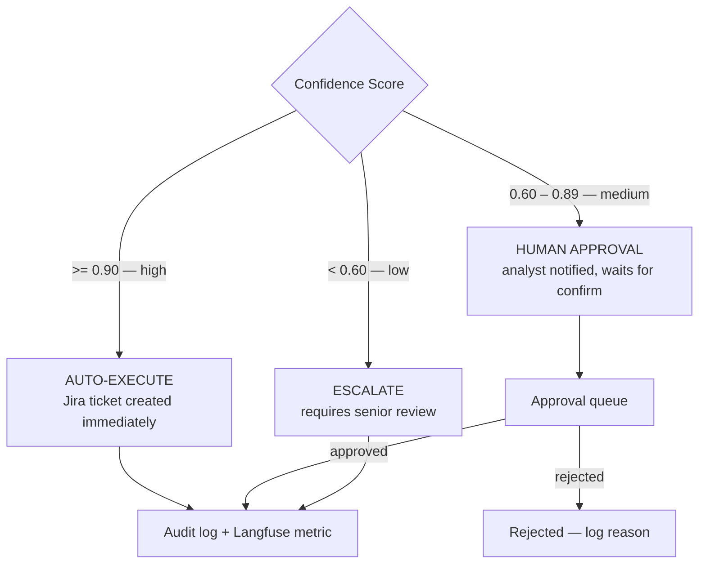
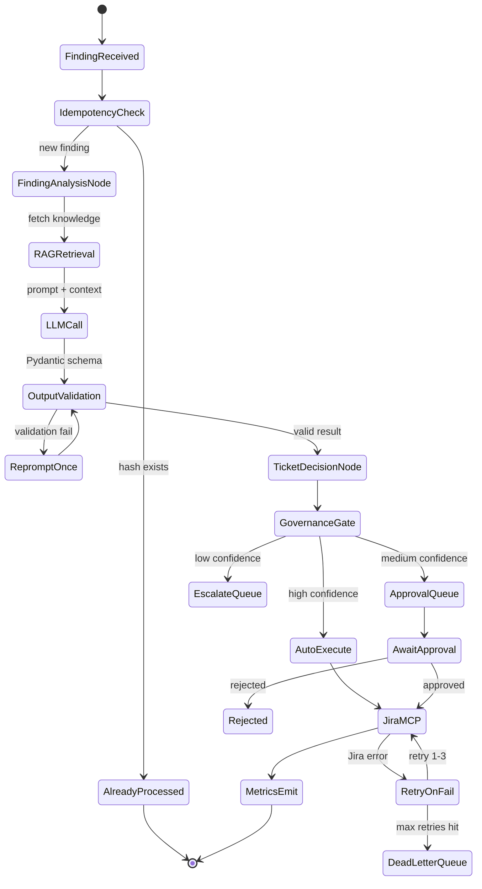
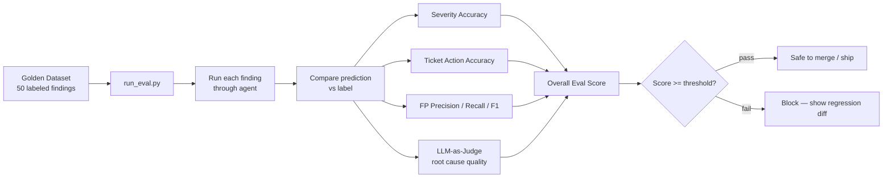
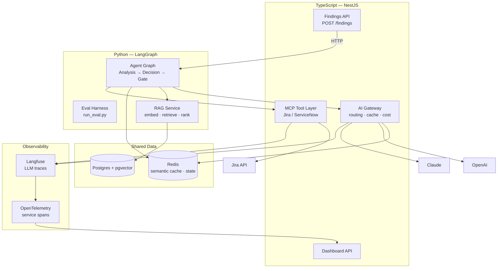
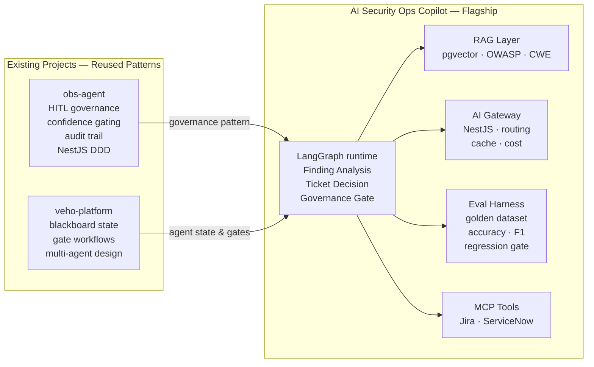
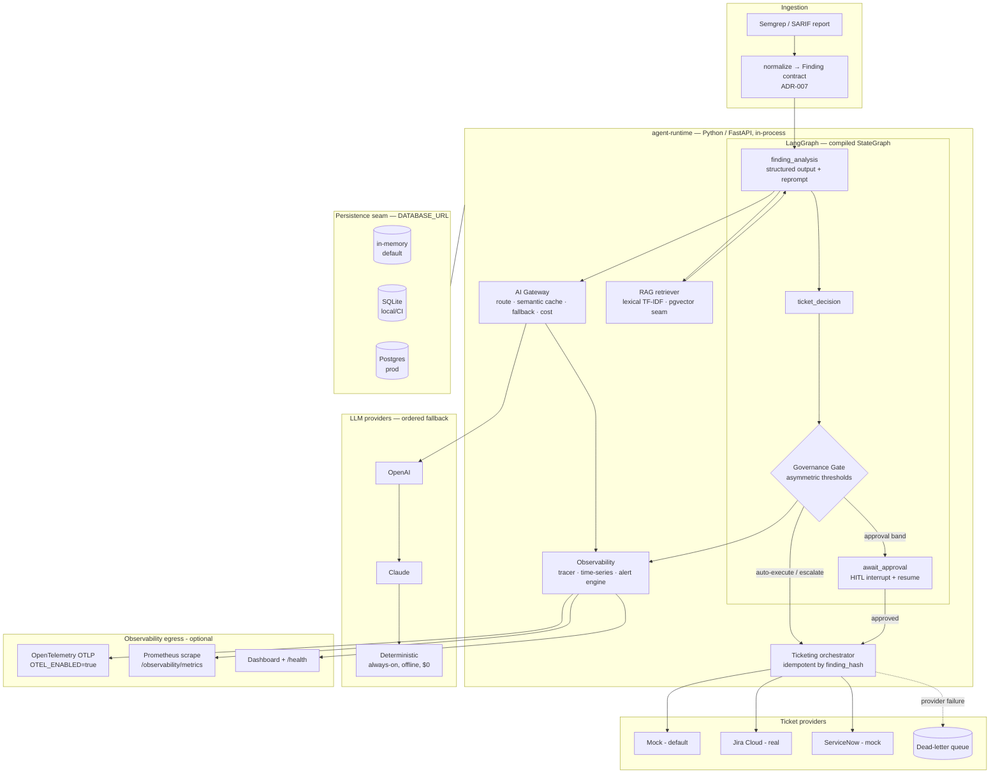

# Architecture Diagrams — AI Security Operations Copilot

> **Target vs as-built.** Sections 1–8 show the **target** architecture (the full product
> vision: NestJS egress, Langfuse, managed providers). Section 9 shows the **as-built runtime
> as of Day 14** — what actually runs today: an in-process Python AI Gateway, an in-process
> observability stack (tracer + Prometheus exposition + alert engine, optional OpenTelemetry),
> pluggable persistence (memory → SQLite → Postgres), and a deterministic offline fallback so
> the whole system runs with no keys. Where the two differ, the as-built diagram is authoritative.

---

## 1. Full System Architecture

Shows every component and how they connect. The AI Gateway sits before the LLM — it is the
single egress point for all model calls.

---

## 2. End-to-End Request Flow

The path a single finding takes from ingestion to Jira ticket.

---

## 3. Governance Gate — Confidence Flow

---

## 4. LangGraph — Agent State Flow

---

## 5. Failure Handling Paths

```mermaid
flowchart TD
    subgraph llm [LLM Failure]
        L1[LLM timeout] --> L2[Retry with backoff]
        L2 --> L3{Retry ok?}
        L3 -->|yes| L4[Continue]
        L3 -->|no| L5[Claude fallback]
        L5 --> L6{Fallback ok?}
        L6 -->|no| L7[Escalate finding]
    end

    subgraph out [Bad Output]
        O1[Invalid JSON / schema] --> O2[Re-prompt once with error]
        O2 --> O3{Valid?}
        O3 -->|yes| O4[Continue]
        O3 -->|no| O5[Escalate — do not execute tool]
    end

    subgraph jira [Jira Failure]
        J1[Jira API error] --> J2[Retry 1-3x backoff]
        J2 --> J3{Ok?}
        J3 -->|yes| J4[Ticket created]
        J3 -->|no| J5[Dead Letter Queue]
        J5 --> J6[Alert + manual review]
    end

    subgraph dup [Duplicate Prevention]
        D1[Incoming finding] --> D2[Compute finding_hash]
        D2 --> D3{Hash seen?}
        D3 -->|yes| D4[Skip — return existing ticket_id]
        D3 -->|no| D5[Process normally]
    end
```

---

## 6. Evaluation Pipeline Flow

---

## 7. Hybrid Deployment Topology

Shows how the two services talk to each other and to shared infra.

---

## 8. Career Narrative — How the projects connect

For interviews: shows you built a *platform*, not isolated demos.

---

## 9. As-Built Runtime (Day 14)

What actually runs today. Everything in the `agent-runtime` box is **in-process Python**, so the
whole platform runs offline with no keys (the deterministic provider is the always-on fallback).
The NestJS gateway is the equivalent standalone control-plane (same `llm.types.ts`/`cost.ts`
contract); real providers, OTel export, and Postgres/Redis light up by configuration only.

### Drift from the target diagrams (1–8)

| Concern | Target (1–8) | As-built (Day 14) |
| --- | --- | --- |
| LLM egress | NestJS gateway service | **In-process Python gateway**; NestJS is the standalone control-plane scaffold |
| Providers | OpenAI primary, Claude fallback | OpenAI → Claude → **deterministic** (offline, always-on final fallback) |
| Semantic cache | Redis (cosine) | **Lexical Jaccard** in-process offline; Redis/cosine is the prod upgrade behind the same seam |
| LLM tracing | Langfuse | **In-process tracer** + structured JSON logs; **OpenTelemetry OTLP** is the opt-in export (Langfuse not built) |
| Metrics | Langfuse dashboards | **Prometheus** text exposition + rolling time-series + **alert rule engine** |
| Vector store | pgvector (required) | **Lexical retriever** default; pgvector behind the `KnowledgeRetriever` seam |
| State | Postgres | **memory → SQLite → Postgres** via `DATABASE_URL` (identical SQL schema) |
| Run | — | `python scripts/demo_walkthrough.py` (offline) · `docker compose up` (full stack) |
